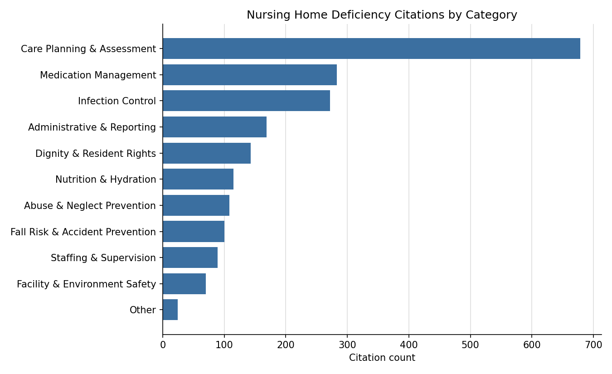

# Nursing Home Deficiency Coverage & Quality Report -- RI

Total citations analyzed: **2052**

## Citations by Category

| category                        |   citation_count |   recurring_count |   avg_severity_rank |   recurring_rate |   pct_of_total_citations |
|:--------------------------------|-----------------:|------------------:|--------------------:|-----------------:|-------------------------:|
| Care Planning & Assessment      |              679 |               267 |                2.11 |            0.393 |                     33.1 |
| Medication Management           |              283 |                90 |                2.16 |            0.318 |                     13.8 |
| Infection Control               |              272 |               108 |                2.08 |            0.397 |                     13.3 |
| Administrative & Reporting      |              169 |                43 |                2    |            0.254 |                      8.2 |
| Dignity & Resident Rights       |              143 |                15 |                1.94 |            0.105 |                      7   |
| Nutrition & Hydration           |              115 |                19 |                2.23 |            0.165 |                      5.6 |
| Abuse & Neglect Prevention      |              108 |                29 |                2.32 |            0.269 |                      5.3 |
| Fall Risk & Accident Prevention |              100 |                47 |                2.83 |            0.47  |                      4.9 |
| Staffing & Supervision          |               89 |                16 |                2.25 |            0.18  |                      4.3 |
| Facility & Environment Safety   |               70 |                10 |                2.06 |            0.143 |                      3.4 |
| Other                           |               24 |                 0 |                2.04 |            0     |                      1.2 |

## Citations by Severity Band

| severity_label     |   citation_count |   pct_of_total_citations |
|:-------------------|-----------------:|-------------------------:|
| Low                |               40 |                      1.9 |
| Moderate           |             1785 |                     87   |
| High               |              112 |                      5.5 |
| Immediate Jeopardy |              115 |                      5.6 |

## Top 20 Facilities by Citation Volume

|   cms_certification_number_ccn | provider_name                                      | state   |   citation_count |   recurring_count |   avg_severity_rank |   immediate_jeopardy_count |
|-------------------------------:|:---------------------------------------------------|:--------|-----------------:|------------------:|--------------------:|---------------------------:|
|                         415039 | Heritage Hills Nursing & Rehabilitation Center     | RI      |               73 |                37 |                2.1  |                          3 |
|                         415078 | Coventry Operations RI LLC DBA Respiratory and Reh | RI      |               67 |                26 |                2.39 |                         10 |
|                         415079 | Cedar Haven Operations Holding LLC Valley View Hea | RI      |               64 |                31 |                2.31 |                          8 |
|                         415129 | AdviniaCare Summit Commons, LLC                    | RI      |               63 |                24 |                2.27 |                          8 |
|                         415099 | Crystal Lake Rehabilitation and Care Center        | RI      |               60 |                25 |                2.17 |                          5 |
|                         415059 | AdviniaCare Orchard, LLC                           | RI      |               59 |                22 |                2.36 |                         10 |
|                         415084 | Elmhurst Rehabilitation and Healthcare Center      | RI      |               57 |                25 |                2.26 |                          6 |
|                         415035 | Lincolnwood Rehabilitation and Healthcare Center   | RI      |               54 |                21 |                2.2  |                          3 |
|                         415087 | Greenville Operations RI LLC DBA Greenville Skille | RI      |               51 |                17 |                2.22 |                          4 |
|                         415064 | Pawtucket Falls Healthcare Center                  | RI      |               46 |                 9 |                2.15 |                          4 |
|                         415049 | Cedar Haven Operations LLC DBA Lake Forrest Health | RI      |               45 |                26 |                2.24 |                          5 |
|                         415110 | AdviniaCare Oakland Grove LLC                      | RI      |               43 |                20 |                2.16 |                          1 |
|                         415008 | Greenwood Operations DBA Greenwood Center          | RI      |               41 |                15 |                2.24 |                          3 |
|                         415033 | AdviniaCare Newport, LLC                           | RI      |               41 |                13 |                2.05 |                          1 |
|                         415034 | Grand Islander Center                              | RI      |               40 |                15 |                2.05 |                          0 |
|                         415044 | The Friendly Home                                  | RI      |               38 |                11 |                2.24 |                          4 |
|                         415119 | Berkshire Place                                    | RI      |               38 |                 9 |                2.16 |                          0 |
|                         415082 | Riverview Healthcare Community                     | RI      |               38 |                13 |                2.11 |                          2 |
|                         415038 | Adviniacare Providence Dodge Rehab Center, LLC     | RI      |               37 |                14 |                2.16 |                          2 |
|                         415108 | Harris Health Care Center North                    | RI      |               37 |                10 |                2    |                          0 |
